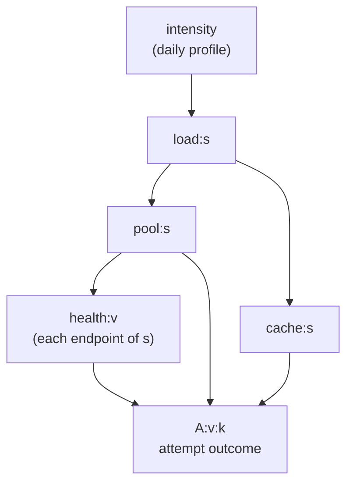
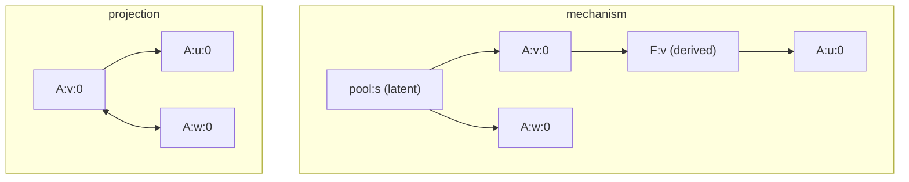

# trace-bench from the Ground Up

### A simulated microservice trace benchmark that ships the causal mechanism that generated it

## 1. The problem, and what one run promises

Suppose you have a web platform: browsers talk to an edge tier, the edge tier
fans out to backend services, services call other services, and everything
writes logs. Something goes wrong at 03:14 and a hundred endpoints turn red.
*Root-cause analysis* (RCA) asks which component started it. A stronger
question, and the one this lab cares about, is **causal-structure discovery**:
which endpoint's outcome influences which other endpoint's outcome, and can an
algorithm recover that graph from the logs alone?

To score such an algorithm you need the true graph. For real systems nobody has
it. The benchmarks surveyed in this lab's corpus fall into two families, and
both fail the same test:

- **Real-telemetry suites** (RCAEval and its predecessors) label the root-cause
  *service* of each injected fault but ship **no ground-truth graph at all**.
  Every reported number is a ranking metric (was the culprit in the top three?),
  so the structural accuracy of a recovered graph is unmeasurable.
- **Suites that do ship a graph** ship it only for synthetic subsets, at coarse
  service or metric granularity, and their "truth" is often reconstructed from
  the very assumptions the evaluated method encodes. A score against a
  reconstructed truth is circular.

trace-bench takes the only escape route: **manufacture the world**, write down
the mechanism that drives it, generate traces from that mechanism, and publish
both. Its one-line invariant is worth memorising:

> **Ground truth is emitted by construction, never inferred from the output.**

One `generate` run, from one declarative configuration and one seed, produces a
self-contained corpus directory holding:

| Artifact | What it is |
|---|---|
| raw feed | every log record each component emitted, with no parent pointers |
| oracle linkage | the true parent record and true session of every raw record |
| mechanism graph | every state variable, latent ones flagged, every edge with a strength |
| scoring target | the mechanism's latent projection over observable event types |
| topology + prior | the deployment call graph, shipped as a candidate structural prior |
| labels | injected faults with root-cause labels, never visible to a method |
| correlated views | parent-linked sequences a sequence model can pretrain on |
| manifest | config, seed, tool and constants version, per-file checksums |

Throughout, the code is the reference. Section numbers below map onto modules
of `src/tracebench/`; a module-to-concept map closes §13.

---

## 2. The simulated world

### 2.1 Components

The system has four kinds of component, called **kinds** in the code:

- **Clients** (browsers). A client operation is a page or action; it is the
  root of every request.
- **The BFF** ("backend for frontend"), the single edge tier every browser
  request hits first. It has `bff_endpoints` endpoints.
- **Backend services**, each exposing `endpoints_per_service` endpoints. A
  service sits at a **depth** (layer) 1, 2, 3, ...
- **External services**, one endpoint each, at the deepest layer.

An **operation** ("op") is one endpoint of one component. Operation ids are
dense integers; every op has a `kind`, a `service` and a `depth`.

### 2.2 The call topology

At instantiation the generator samples a **deployment call topology**: a set of
call edges from a caller op to a callee op. The topology is a **layered DAG at
the endpoint level**: the BFF is depth 0, an endpoint at depth $d$ only calls
endpoints strictly deeper than $d$, and externals sit below everyone. Two
consequences follow immediately: every request tree is acyclic, and every
backend endpoint has one well-defined depth.

Each call edge carries four sampled attributes that the mechanism will use:

| Attribute | Meaning |
|---|---|
| `critical` | a failure of the callee matters to the caller (share set by `criticality_share`) |
| `rho` | probability that a critical callee failure actually reaches the caller's outcome |
| `cached` | the call is fronted by a cache; a warm cache skips it |
| `p_hit` | cache-hit probability while the cache is warm |

Fan-out is an instance *target* (a truncated Poisson with mean `fanout_mean`),
not an inherited constant: the real reference system that the realism constants
were fitted on is star-shaped (96 percent of root spans call nothing), and a
benchmark of single-hop requests would be uninteresting. The realism report
states the deviation instead of hiding it (§13).

Two rules guarantee that **every operation lies on some journey**: an endpoint
no sampled call reaches is attached to a caller that is itself reachable from
the BFF, and scenarios (next) draw their BFF endpoints first from those no
earlier scenario visits. Without both, a third of the operations at the larger
rungs carried no traffic and the realized alphabet fell short.

### 2.3 Scenarios, sessions, requests, hops

A **scenario** is a business journey: an ordered list of **steps**, each step
being a client operation that calls one BFF endpoint. A scenario also declares
its **repertoire** (which outcomes the client and the BFF may show), a **retry
policy** (how many client-side retries, on which outcomes), and whether an error
is fatal for the journey.

A **session** is one client executing one scenario: it arrives at a random time,
performs step 0, waits a sampled gap, performs step 1, and so on, until it either
finishes or a step fails terminally. Each step is one **request**: the client
calls the BFF endpoint, which calls its callees, which call theirs. The request
therefore traverses a **request tree**, a subtree of the topology rooted at the
BFF endpoint. Every node visit in that tree is a **hop**; a retried hop is a
second **attempt** of the same op.

### 2.4 Outcomes and the alphabet

Every attempt of every op ends in one of five **outcomes**:

$$
\text{ok} \prec \text{slow} \prec \text{4xx} \prec \text{5xx} \prec \text{err}
$$

read as precedence: when several apply, the rightmost wins. `4xx` is a client
error, `5xx` a server error, `err` a transport failure with no status at all,
and `slow` means the attempt succeeded but its total duration exceeded a
per-operation threshold (the configured quantile of the op's nominal duration).
SLOW exists because latency-only faults would otherwise be invisible to a method
that sees only outcome tokens (deviation D-TB-1 in `RUN.md`). On the mechanism
side a sixth value, `absent`, records that the op was not invoked in this
request at all; it is a state value but never a token.

The central object of the whole benchmark is the **event type**, or token:

$$
\text{token} = (\text{operation}, \text{outcome})
$$

An op with five outcomes contributes up to five tokens; the set of all tokens an
instance can emit is its **alphabet**. A sequence model reasons in this alphabet,
and the scoring target's nodes are these tokens (D-TB-2). That is what "a known
graph over the same alphabet the model reasons in" means concretely.

### 2.5 The ladder

Five **named instances** form a size ladder. Each is a checked-in configuration
file, so citing one names a file.

| Rung | Services x endpoints (+ BFF) | Expected realized tokens |
|---|---|---|
| xs | 3 x 3 (+4) | 45 |
| s | 10 x 5 (+8) | 185 (realized 322) |
| m | 50 x 10 (+20) | 1,548 |
| l | 150 x 10 (+30) | 4,531 |
| xl | 350 x 12 (+60) | 12,554 |

The top rung is deliberately sized past the largest synthetic alphabet the
target method has been evaluated on (8,000), so the rung where a method breaks
lies inside the suite. Every named instance ships at least five seeds and an
observable twin (§9). Windows are one simulated day at a few requests per
second; the estimator that sizes them is calibrated against the realized `s`
run (6 GB, 47 minutes on a laptop).

---

## 3. State variables: a two-timescale dynamic Bayesian network

### 3.1 From components to variables

A *state variable* is anything whose value can change and can influence
something else. trace-bench's mechanism has three families, distinguished by
how often they are drawn.

**Tick-level latents** evolve once per simulated tick (one second) and persist
across ticks. They describe the health of the infrastructure:

| Variable | Values (nominal first) | Per |
|---|---|---|
| `intensity` | day, night, peak | whole system |
| `load:s` | mid, low, high | service $s$ |
| `pool:s` | free, tight, exhausted | service $s$ (connection pool) |
| `cache:s` | warm, cold | service $s$ |
| `health:v` | healthy, degraded, failed | endpoint $v$ |

**Session-level latents** are drawn once per session: `net:c` (good, flaky
network) and `auth:c` (valid, expired credential), one pair per scenario $c$.

**Event-level variables** are drawn per request. For a backend endpoint $v$
with $R$ permitted retries:

| Variable | Meaning | Values |
|---|---|---|
| `I:v` | was $v$ invoked in this request? | present, absent |
| `A:v:k` | outcome of attempt $k$ of $v$ | the six T values |
| `F:v` | final outcome of $v$ (last non-absent attempt) | the six T values |

For a BFF endpoint the attempt variable is indexed by journey context,
`T:bff:c:j:k` for scenario $c$, step $j$, client retry $k$, with its own
invocation `I:bff:c:j:k`; the client's outcome at that step is `C:c:j:k` (ok,
err, absent) and its final `C:c:j:F`.

### 3.2 Three classes of node

Every node is one of:

- **latent** — appears in no emitted record (all tick and session latents);
- **derived** — a deterministic function of other observables that carries no
  token of its own (`I:v`, `F:v`, the BFF invocations, client finals);
- **token-bearing** — its values are tokens: the attempt variables `A:v:k`,
  `T:bff:c:j:k` and client outcomes `C:c:j:k`.

The distinction drives the projection in §6: latent and derived nodes are what
a projected edge may pass *through*; token-bearing nodes are where projected
edges start and end.

### 3.3 The template and its one structural rule

The tick-level latents form a small DAG template repeated per service, with
lag-1 self-loops (today's load depends on yesterday's load):

Event-level variables read the tick latents of the tick in which the request
starts, plus the session latents, plus the finals of their callees. The one
structural rule the whole design leans on:

> **Observables never point into tick-level latents.** A retry storm does not
> raise load; a burst of errors does not exhaust a pool.

This is a documented limitation, and it buys two things. First, the latent
trajectory is **independent of the requests**, so it can be simulated once,
sequentially, and the request simulation can then be split into parallel
shards (§10). Second, every directed path between observables runs *forward* in
request time, so the projected directed graph is acyclic by construction.

The mechanism is a **dynamic Bayesian network** in the Koller and Friedman
sense: a DAG over variables indexed by time, with two timescales (ticks and
requests). Its "structure" is the union of the edges listed in
`graphs/mechanism-graph.json`; the s rung has a few thousand nodes.

---

## 4. Building a child's conditional table

A graph with strengths needs, for every node, a **conditional distribution**
given its parents: a function from a parent assignment to a probability vector
over the node's values. In the code every node exposes `dist(ctx)`, where `ctx`
maps parent id to value name, and the same tables and samplers feed the engine
that generates data. The graph and the data therefore come from one model.

### 4.1 Tick latents: transition tables

Each tick latent has a table indexed by its parents' values and its own previous
value. The tables are built from named **fitted constants** (§13), for example
`state_dynamics.pool_tight_given_high`, the per-tick hazard of a free pool
turning tight under high load. Health, for instance, has the table
`[pool][health] -> pmf(health')`: under an exhausted pool the hazard of
degradation rises from a base of $0.0005$ per tick to $0.05$, and recovery is
switched off.

### 4.2 Attempt outcomes: class tables, then the worst-of aggregator

An attempt's outcome is assembled in four steps, and the assembly *is* the
mechanism.

**Step 1: the base class table.** Per tier (BFF, service, external) a table
`[health][pool] -> pmf(ok, 4xx, 5xx, err)` gives the endpoint's own error mix.
At nominal state it is the fitted error rate times the instance's
`error_rate_multiplier`. A degraded endpoint or an exhausted pool fails an
explicit *share* of requests on top (D-TB-11): the table row is a mixture of the
nominal pmf and a shift pmf that puts mass only on error classes.

**Step 2: the worst callee.** The callee finals reach the caller through an
**aggregator**. Assign each class a severity: ok and slow are 0, 4xx is 1, 5xx
is 2, err is 3. For each critical call edge with propagation probability
$\rho$, a callee failure of severity $s$ "reaches" the caller with probability
$\rho$. The **worst** reaching severity is the aggregate; if nothing reaches,
the worst is ok.

**Step 3: propagation.** If the worst class is $w \neq \text{ok}$, the caller's
own class is drawn not from its base row but from the propagation row of $w$:

$$
\begin{aligned}
\text{4xx} &\to (0.10,\ 0.80,\ 0.10,\ 0.00) \\
\text{5xx} &\to (0.05,\ 0.00,\ 0.85,\ 0.10) \\
\text{err} &\to (0.05,\ 0.00,\ 0.35,\ 0.60)
\end{aligned}
$$

over (ok, 4xx, 5xx, err). A 5xx downstream mostly becomes a 5xx upstream,
sometimes an err, occasionally nothing.

**Step 4: SLOW and presence.** The ok mass is split into ok and slow by the
probability $p_{\text{slow}}$ that the hop's total duration exceeds its
threshold, a Monte Carlo estimate from the latency model under the given
health, pool, cache and callee context. Finally the whole vector is scaled by
the probability of being present, with the remainder on absent. A callee
fronted by a warm cache is skipped with probability `p_hit`, so **occurrence is
itself a dependence**: a cold cache makes a call present that a warm cache
would have removed.

### 4.3 Worked example: the worst-of aggregator

Take a service endpoint $u$ at the s rung (multiplier 10, so its own 4xx rate
is $0.00495$ and its base row is ${(0.995,\ 0.005,\ 0,\ 0)}$ to three places).
It has two critical callees: $v$ finished 5xx with ${\rho_v = 0.8}$, and $w$
finished 4xx with ${\rho_w = 0.6}$.

The worst-of computation runs from the highest severity down. Nothing of
severity 3 exists. Severity 2 reaches with probability $0.8$, so
${P(\text{worst} = \text{5xx}) = 0.8}$ and the probability that nothing of
severity 2 or higher reached is $0.2$. Severity 1 reaches with probability
$0.6$, but it only counts if nothing higher reached:
${P(\text{worst} = \text{4xx}) = 0.2 \times 0.6 = 0.12}$. What remains,
${0.2 \times 0.4 = 0.08}$, is worst = ok. So the worst vector over
(ok, 4xx, 5xx, err) is ${(0.08,\ 0.12,\ 0.80,\ 0)}$.

The attempt's class pmf is the worst-weighted mixture of the rows:

$$
\begin{aligned}
0.08 \times (0.995, 0.005, 0, 0) &= (0.0796, 0.0004, 0, 0) \\
0.12 \times (0.10, 0.80, 0.10, 0) &= (0.0120, 0.0960, 0.0120, 0) \\
0.80 \times (0.05, 0.00, 0.85, 0.10) &= (0.0400, 0, 0.6800, 0.0800)
\end{aligned}
$$

which sums to ${(0.132,\ 0.096,\ 0.692,\ 0.080)}$. Endpoint $u$, healthy on a
free pool, now fails about 87 percent of the time, and the split between 4xx
and 5xx tells a reader which callee did it. That table row is one entry of the
node `A:u:0`'s conditional distribution, and the engine draws from exactly it.

---

## 5. Edge strength: total variation at the nominal context

### 5.1 Total-variation distance

Given two probability vectors $p$ and $q$ over the same values, their
**total-variation distance** is

$$
\mathrm{TV}(p, q) = \tfrac{1}{2} \sum_{x} \lvert p(x) - q(x) \rvert ,
$$

a number in $[0, 1]$: zero when the distributions coincide, one when they put
mass on disjoint values. It is the largest change in the probability of any
event you can make by switching from $p$ to $q$, which is exactly the right
ruler for "does changing the parent change the child?".

### 5.2 The definition (D-TB-3)

An edge $P \to C$ is recorded with the strength

$$
s(P \to C) = \max_{a \neq b}\ \mathrm{TV}\big(P_C(\cdot \mid a, \mathbf{nom}),\ P_C(\cdot \mid b, \mathbf{nom})\big),
$$

the largest total-variation distance between the child's distributions
$P_C(\cdot \mid a, \mathbf{nom})$ under any two values $a, b$ of the parent,
with the child's **other parents held at their nominal values** $\mathbf{nom}$
(index 0 of every value list: healthy, free, warm, present, ok). Two
refinements:

- **Incompatible values are excluded.** An attempt cannot be absent while the
  op's final is held non-absent; holding the other parents is what makes such
  values impossible, so they do not enter the maximum.
- **A context-max strength** is recorded beside the nominal one when the other
  parent set has at most four members: the maximum of the same quantity over
  *all* assignments of the other parents. It exists because a parent can be
  inert at nominal and decisive elsewhere (an AND-gate shape).

Every mechanism edge, however faint, is stored with its strength. The floor
(§8) is applied later and elsewhere.

### 5.3 Worked example: health drives the attempt outcome

Service tier, s rung, other parents nominal. From §4 the base row for a healthy
endpoint on a free pool is ${(0.99505,\ 0.00495,\ 0,\ 0)}$. The fitted
`error_shift.degraded` says a degraded endpoint fails half its requests with
shift ${(0,\ 0,\ 0.72,\ 0.28)}$ over the error classes, so its row is the
half-and-half mixture

$$
\begin{aligned}
&0.5 \times (0.99505,\ 0.00495,\ 0,\ 0) + 0.5 \times (0,\ 0,\ 0.72,\ 0.28) \\
&\quad = (0.4975,\ 0.0025,\ 0.36,\ 0.14).
\end{aligned}
$$

A failed endpoint's row is the fitted `error_shift.failed`,
${(0.05,\ 0,\ 0.70,\ 0.25)}$. The three pairwise distances are

$$
\begin{aligned}
\mathrm{TV}(\text{healthy}, \text{degraded}) &= \tfrac{1}{2}(0.4975 + 0.0025 + 0.36 + 0.14) = 0.50 \\
\mathrm{TV}(\text{healthy}, \text{failed}) &= \tfrac{1}{2}(0.945 + 0.005 + 0.70 + 0.25) = 0.95 \\
\mathrm{TV}(\text{degraded}, \text{failed}) &= \tfrac{1}{2}(0.4475 + 0.0025 + 0.34 + 0.11) = 0.45
\end{aligned}
$$

so ${s(\texttt{health:}v \to \texttt{A:}v\texttt{:0}) = 0.95}$. The real
number differs in the third decimal because the ok mass is further split into
ok and slow, and a degraded endpoint's own time is multiplied by 3, which moves
$p_{\text{slow}}$ too. The point of the example is the shape: the strength is a
plain arithmetic consequence of tables the reader can print.

### 5.4 Tick latents are held, not pulsed

For a parent that is a tick-level latent with a self-loop, "holding the parent
at $a$" must mean *for hours*, not for one tick: a pool that is exhausted for a
single second barely moves anything. The code therefore uses, for a held
lag-1 chain, the **stationary distribution** of the transition matrix under the
held parent, found by power iteration.

**Worked example: pool drives health.** Under a free pool the health chain has
hazards degrade $0.0005$, fail-given-degraded $0.01$, recover $0.02$. Balancing
the flows of this birth-death chain gives
${\pi_1 = 0.025\pi_0}$ and ${\pi_2 = 0.5\pi_1}$, so the stationary vector is
${(0.964,\ 0.024,\ 0.012)}$ over (healthy, degraded, failed). Under an
exhausted pool the degrade hazard is $0.05$ and recovery is switched off, so
healthy is transient and all mass ends in ${(0,\ 0.667,\ 0.333)}$. The strength
of `pool:s -> health:v` is ${\mathrm{TV} = \tfrac{1}{2}(0.964 + 0.643 + 0.321) = 0.96}$.
A one-tick impulse would have reported something near $0.05$.

---

## 6. Latent projection: from a graph with hidden nodes to a scoreable target

### 6.1 Why the mechanism graph cannot be the target

A method that reads only traces can never place a node for `pool:s`, because
nothing it sees names a pool. Scoring it against the mechanism graph would floor
every method below a perfect score by construction. The designers' decision was to
keep the mechanism as the *published truth* and to derive from it a **scoring
target** in which every node is a token, so that a perfect score is attainable
and latent confounding is scored explicitly rather than charged as a silent
penalty.

### 6.2 Two kinds of projected edge

Let $X$ and $Y$ be token-bearing nodes, and call latent and derived nodes
"through" nodes. The projection (the summary-graph version of Verma's latent
projection, the same construction that gives Richardson's ancestral graphs
with bidirected edges) has two rules:

- **Directed** ${X \to Y}$ exists if there is a directed path from $X$ to $Y$
  whose interior nodes are all through nodes. A latent or derived mediator
  collapses into a direct edge.
- **Bidirected** ${X \leftrightarrow Y}$ exists if some latent $\ell$ reaches
  both $X$ and $Y$ along through-only paths. A hidden common cause becomes a
  confounding edge, drawn with arrowheads at both ends.

The result is a **mixed graph**: directed edges plus bidirected edges over the
same nodes. Its directed part is acyclic (§3.3).

### 6.3 Strengths by exact marginalisation

A projected edge needs a strength too, and it must be the strength *as it
appears among observables*. The projector computes, for a source value $x$,

$$
P(Y \mid \mathrm{do}(X = x))
$$

by enumerating the intermediates in topological order and summing them out
exactly (a "frontier-merged" enumeration that keeps only the intermediate
values later nodes still need, pruning mass below $10^{-10}$). Every other
parent of every node on the way is held at its nominal context, and a
tick-level latent that is held contributes its stationary distribution (§5.4).
The notation $\mathrm{do}(\cdot)$ is Pearl's: set the variable by intervention
rather than observe it, which here simply means "plug the value into the
tables". For a bidirected edge the two arms $\ell \to X$ and $\ell \to Y$ are
computed the same way and combined by a minimum (§7.2, D-TB-4).

### 6.4 Worked example: a route through a derived node

Take an instance with no backend retries, so `F:v` has the single parent
`A:v:0` and equals it deterministically. Endpoint $u$ calls $v$ on a critical
edge with ${\rho = 0.8}$; $u$'s own base row is ${(0.995,\ 0.005,\ 0,\ 0)}$.
The path ${\texttt{A:v:0} \to \texttt{F:v} \to \texttt{A:u:0}}$ has one interior
node, derived, so the projection draws ${\texttt{A:v:0} \to \texttt{A:u:0}}$.
Marginalising `F:v` is trivial (it copies its parent), and §4's aggregator
gives $P(\texttt{A:u:0} = \text{5xx} \mid \mathrm{do}(\texttt{A:v:0} = x))$:

| $x$ | worst reaching | $P(\text{5xx})$ |
|---|---|---|
| ok, slow, absent | nothing | $0$ |
| 4xx | 4xx w.p. 0.8 | ${0.8 \times 0.10 = 0.08}$ |
| 5xx | 5xx w.p. 0.8 | ${0.8 \times 0.85 = 0.68}$ |
| err | err w.p. 0.8 | ${0.8 \times 0.35 = 0.28}$ |

(ignoring the slow split of the ok mass). These six vectors are the raw
material §7 turns into token strengths. With retries switched on, `F:v` has two
attempt parents and the same token pair is reached from each of them; the pair
keeps the maximum (§7.3).

### 6.5 Project first, floor second

The PRD pins an order: the strength floor (§8) is applied to the **projected**
edge, never to the mechanism edges that compose it. Operationally this is
visible in the code: `build_targets` stores every projected edge with its
strength and only the scorer's `truth_sets` compares against the floor.

The stated rationale is that detectability is a property of the dependence as
it shows among observables. Two honest remarks belong here. For a *single
chain* ${X \to M \to Y}$ the order cannot matter in the direction the PRD
worries about, because total variation is contracted by any Markov kernel:

$$
\mathrm{TV}\big(P(Y \mid \mathrm{do}(x_1)),\ P(Y \mid \mathrm{do}(x_2))\big) \le \mathrm{TV}\big(P(M \mid x_1),\ P(M \mid x_2)\big),
$$

so a chain of sub-floor links composes to something sub-floor. Where the order
*does* matter is when a mechanism edge's nominal-context strength understates
the dependence, as with interaction effects (the context-max case of §5.2) or
several mechanism edges mapping onto one token pair (§7.3). The PRD records the
pin as "by argument, not yet validated empirically"; the floor sweep of §8 is
the instrument that would validate it.

---

## 7. Token expansion: from variables to (operation, outcome) edges

### 7.1 Why expand

A projected edge ${\texttt{A:v:0} \to \texttt{A:u:0}}$ relates two
six-valued variables. The scoring target's nodes are tokens, one per
(operation, outcome) pair, so that a method can be credited separately for
discovering that $v$'s 5xx drives $u$'s 5xx and penalised separately for
claiming that $v$'s ok drives $u$'s err. Each variable pair therefore expands
into up to $5 \times 5$ token pairs.

### 7.2 The definitions

For source value $x$ and destination value $y$, the **directed token strength**
is the one-versus-rest Bernoulli total variation under uniform replacement:

$$
s\big((X{,}x) \to (Y{,}y)\big) = \Big\lvert P(Y{=}y \mid \mathrm{do}(X{=}x)) - \mathrm{mean}_{x' \neq x}\ P(Y{=}y \mid \mathrm{do}(X{=}x'))\Big\rvert .
$$

Read it as: how much does the probability of seeing token $(Y, y)$ move when
$X$ is set to $x$ rather than to a uniformly chosen other value? Two
Bernoulli distributions differ in total variation by exactly the absolute
difference of their success probabilities, which is why the bars are all that
is needed.

For a **bidirected token edge** through latent $\ell$ with values $a$, define
the arm ${\delta_X(\ell, a, x)}$ by the same formula with $\ell$ as the source;
then

$$
s\big((X{,}x) \leftrightarrow (Y{,}y)\big) = \max_{\ell}\ \max_{a}\ \min\big(\delta_X(\ell,a,x),\ \delta_Y(\ell,a,y)\big).
$$

The minimum is the "weaker arm" rule (D-TB-4): a confounder that moves $X$ a
lot and $Y$ barely is barely a confounder of the pair. The maximum over $a$
picks the latent value that does the most; the maximum over $\ell$ picks the
strongest confounder.

### 7.3 Two conventions

- **A token pair takes the maximum over the variable pairs that map onto it.**
  Retry attempts `A:v:0`, `A:v:1` and the several journey contexts of a BFF
  endpoint all map onto the same op; the strongest route wins.
- **Within-operation pairs are recorded apart and never scored.** A retry
  produces $(v, \text{5xx})$ followed by $(v, \text{ok})$, a genuine temporal
  dependence between two tokens of the same operation, but it is not
  structure between components. Such pairs live in `retry_pairs`.

### 7.4 Worked example: expanding the route of §6.4

From the table in §6.4, ${P(\texttt{A:u:0}=\text{5xx} \mid \mathrm{do}(\texttt{A:v:0}=x))}$ is
$(0, 0.08, 0.68, 0.28, 0, 0)$ over (ok, 4xx, 5xx, err, slow, absent). Then:

$$
\begin{aligned}
s\big((v,\text{5xx}) \to (u,\text{5xx})\big) &= \lvert 0.68 - \tfrac{0 + 0.08 + 0.28 + 0 + 0}{5} \rvert = 0.608 \\
s\big((v,\text{err}) \to (u,\text{5xx})\big) &= \lvert 0.28 - \tfrac{0 + 0.08 + 0.68 + 0 + 0}{5} \rvert = 0.128 \\
s\big((v,\text{ok}) \to (u,\text{5xx})\big) &= \lvert 0 - \tfrac{0.08 + 0.68 + 0.28 + 0 + 0}{5} \rvert = 0.208
\end{aligned}
$$

The third line deserves a pause: a callee's *ok* is a real cause of the
caller's *not*-5xx, and the target records it as an edge of strength $0.208$.
A method that discovers only "errors cause errors" leaves such edges on the
table, and the floor sweep will show at which floor they enter.

**A bidirected example.** The session latent `net:c` (good, flaky) is a parent
of every client outcome `C:c:j:k` of scenario $c$ and of nothing else. With the
BFF outcome at nominal ok, a flaky network raises the client error probability
from $0$ to $0.05$. For two steps $j = 0, 1$:
${\delta_{C_0}(\text{net}, \text{flaky}, \text{err}) = \lvert 0.05 - 0 \rvert = 0.05}$
and the same for the good value and for $C_1$. So
${s\big((\text{page}_0, \text{err}) \leftrightarrow (\text{page}_1, \text{err})\big) = \max(0.05, 0.05) = 0.05}$,
exactly at the default floor, and a confounded pair of client-error tokens
enters the target at the session grain. It does not enter at the request grain,
which is the subject of the next section.

---

## 8. The floor, its sweep, co-occurrence support and the two grains

### 8.1 The floor and the sweep

The **strength floor** (default $0.05$) is the strength at or above which a
projected edge joins the scoring target. Dependences below it are excluded from
scoring rather than charged against a method that misses them: a benchmark
should not penalise the failure to detect what is undetectable at any sample
size. Because every edge is stored with its strength, the corpus also ships a
**floor sweep**, ${(0.01, 0.02, 0.05, 0.10, 0.20, 0.50)}$, reporting at each
floor the edge counts, density, node coverage and whether the directed part is
acyclic. Detectability becomes a measured axis, and the sweep is the calibration
instrument the target method's single decision threshold needs.

### 8.2 Co-occurrence support (D-TB-10)

Left unrestricted, the projection has a pathology: `intensity` is a latent
ancestor of every attempt in the system, so every pair of slow tokens anywhere
would be a bidirected edge, a target no within-sequence method could fairly be
scored against. The target is therefore restricted to a **scoring universe**:
ordered token pairs whose operations can **co-occur**.

- **Request grain**: the two ops can share one request tree (both reachable
  from a common BFF endpoint). Pairs are directed forward in request time, so
  the request-grain target is acyclic by construction.
- **Session grain**: the two ops can share one journey. This adds journey
  edges (a step's client outcome gating the next step's invocation) and
  cross-request confounding such as the `net` example above, and it may be
  cyclic at the type level (the same op can appear at two steps). When the
  session-grain truth is cyclic the causal-validity axis is not applicable, and
  the reason recorded is the charter's cyclicity clause.

Predictions outside the universe are counted, never scored. The mechanism graph
itself stays unrestricted.

### 8.3 Coarsened views

Two coarser graphs are derived **from the target alone**, without touching the
raw feed: an **endpoint-level** view (max strength over the token pairs of an
op pair) and a **service-level** view. They exist for comparability with the
microservice RCA literature, which scores at those grains. The deployment call
topology is *not* one of these views: it is recorded at instantiation and
shipped separately as `topology/callgraph.json` (caller to callee) and
`topology/prior.json` (callee to caller, the direction outcomes propagate,
usable as a structural prior).

---

## 9. The observable twin

The lab's success bar includes a **causal-validity axis**: the structural
intervention distance (SID) and its adjustment-identification cousins (AID),
which are defined only over DAGs. A target with bidirected edges is not a DAG,
so on the latent-bearing instance that axis is reported not-applicable, with the
reason stated. To supply the axis at all, every named instance ships a **twin**.

The twin is **the same simulation with its latents observed** (D-TB-5): the
same configuration, seed, topology and random draws, but every latent variable's
value is written onto the records it influences (as `state_*` columns on spans)
and a state-change log is emitted. Its scoring target is the full mechanism DAG
over tokens plus **state tokens** of the form `state:pool:3=exhausted`; no
projection, no bidirected edge. Two alternatives were rejected on purpose:
*clamping* latents to nominal (that conflates "no confounding" with "no
incidents") and *re-simulating* from the projected mechanism (a different
mechanism). Because the pair differs only in what is *observed*, the score gap
between a method's twin result and its latent result **isolates the cost of
latent confounding** as a published number.

---

## 10. Determinism, shards and the forcing hook

### 10.1 Counter-keyed uniforms

Every random draw in the engine is a **pure function of identifiers**: the run
seed, a draw domain, and up to four integer coordinates such as (request id, op,
draw kind, attempt). The mixer is splitmix64 and the result is a uniform in
$[0, 1)$. Nothing depends on call order or on realised outcomes. Three
properties follow at once:

- **Byte-identical reproducibility** across machines (uint64 arithmetic wraps
  identically everywhere; identifiers are blake2b hashes, never Python's
  `hash()` or `uuid4`).
- **Sharded resume**: a shard is a contiguous slice of ticks; it draws exactly
  what an uninterrupted run would have drawn, so a resumed corpus is
  byte-identical to a fresh one.
- **Common random numbers**: two corpora that differ only in a forcing differ
  only where the forcing changed the *mapping* from draws to outcomes, never
  the draws.

### 10.2 The latent pass and the shard pass

Because observables never feed tick latents (§3.3), the generator first advances
the latent trajectory sequentially over the whole window and records its state
at every shard boundary. Workers then simulate shards in parallel: sessions
arriving in a shard are generated atomically (their journeys may spill past the
slice), requests are grouped by BFF endpoint and evaluated vectorised, invocation
top-down, outcomes and durations bottom-up.

### 10.3 One hook, three uses

A **forcing** overrides a node's value over a tick interval. It is the single
mechanism behind:

1. **Fault injection.** A configured fault (`degrade`, `crash`,
   `pool_exhaust`, `cache_flush`, `breaker_open`) on a named component over a
   named interval is compiled into a forcing on `health`, `pool` or `cache`
   slots, and its record (component, kind, interval, forced nodes and value)
   goes to `labels/faults.json`.
2. **The ground-truth check** (PRD scenario 21, `check_mechanism`). For every
   recorded edge ${P \to C}$ the simulation is re-run with $P$ forced to each
   of its values and $C$'s other parents forced to the recorded nominal
   context; the child's empirical distributions are compared and the largest
   total variation must match the recorded strength within $0.03$. A sample of
   non-edges must show a strength of zero within $0.05$ (the looser bound
   exists because a callee's duration varies within its class band and
   reaches the caller's slow class through a channel a categorical graph
   cannot carry; the largest residual is a published number, $0.04$ on xs;
   D-TB-9). This is what makes "by construction" *checkable*.
3. **The twin**, which forces nothing but records everything.

### 10.4 Worked example: a paired fault corpus

Generate the s rung at seed 0 twice, once with the scheduled degrade of
`service:2` over seconds 14,400 to 16,200 and once with no faults. Pick any
request in that interval whose tree does not contain an endpoint of service 2.
Every hop of that request draws its class from
`uniforms(seed, D_HOP, req_gid, op, H_CLASS, k)`, the same key in both corpora,
and its tables are unchanged, so **its outcome is identical bit for bit**. For a
request whose tree does contain service 2, the health slots of those endpoints
are forced to degraded, the class row changes (§5.3), the same uniform now lands
in a different class, and the difference propagates to the callers through the
aggregator. The paired comparison required by PRD scenario 8 (the faulted
component's error rate at least doubles; non-descendants stay within one
percentage point) is thus not a statistical test but an identity, with one
documented caveat: a fault also shifts the *timing* of later journey steps
through retries, so population rates of journey descendants may legitimately
differ.

---

## 11. Emission and the bundled correlator

### 11.1 The raw feed emits what a component would really know

Clean parent-linked spans would assume instrumentation the real target system
does not have. trace-bench instead emits six record kinds that mirror a real
consumer platform's feed:

| Record kind | Emitted by | Carries |
|---|---|---|
| `vl.access` | every nginx, per hop attempt | request id, trace id, status, timing, client address |
| `vl.app` | services, error-gated | request id, a correlation id back to the edge request |
| `vl.audit` | edge + external calls | several identity keys at once (the correlation hub) |
| `sentry.error` | browsers | request id only on app-tagged failures |
| `sentry.transaction` | browsers, sampled | front-end trace id, duration |
| health checks, background | pods, daemons | nothing anyone owns |

and reproduces the enumerated **raw-feed defects**: no parent pointer anywhere;
long lines split into parts whose keys appear only once the parts are merged;
internal hops carrying their own request id plus a correlation id; records
attributable to no actor; client errors lacking the request id; an audit record
co-locating several identity keys; and clock skew per pod and per browser. The
**oracle** keeps, for every record, the true emission time, true parent record,
true request tree and true session.

### 11.2 The correlator and the four views

The bundled **correlator** is a clean-room reimplementation of the documented
correlation model. Per shard it merges split parts, harvests join keys from
free text, resolves connectors (request, correlation, trace and cart ids) to
identities (session, device, user) with one propagation round, attributes each
span at the strongest level it can reach (session, then device, then user, then
network address if enabled, else none), infers **parent links** from access
lines by matching a hop's client address to a caller service and choosing the
most tightly containing interval, and builds request trees. Sequences at
device, user and address level span sessions, so they are stitched across
shards with a close rule ("no record that could still join has yet to be
read"); memory stays bounded by one shard.

The output is four parquet trees in the column contract of the lab's sequence
pipeline (`trace_id, ops, outcomes, offsets, durations, parent_pos, ...`):

$$
\lbrace\text{end}, \text{start}\rbrace \times \lbrace\text{request}, \text{session}\rbrace
$$

`end` ordering sorts spans by completion time, so a callee precedes its caller
and `parent_pos[j] > j`; `start` ordering sorts by start time. Both
are shipped because **the ordering decides which edges an earlier-to-later test
can express at all**. Millisecond ties are broken by containment, then by
inferred depth; genuine inversions are counted, never repaired.

### 11.3 Correlation loss is a number

Because the oracle exists, the loss the correlation step itself introduces is a
**measured, published quantity**: parent-link precision and recall, the
unattributed fraction, session recovery. On the realized s run the parent-link
F1 was $0.9994$ and $0.56$ percent of records were unattributed. These are
reported quantities, not pass thresholds; the benchmark's purpose is to measure
the loss, not to hit a target for it. A method sees the raw feed and the views
only; faults, cases, the mechanism, the target and the oracle are all outside
its permitted set.

---

## 12. Scoring

### 12.1 The universe and the prediction

A prediction is a JSON file listing directed edges (src, dst, score) and
bidirected edges (a, b, score). The **universe** is the set of ordered token
pairs in co-occurrence support (§8.2), with within-operation pairs excluded;
predictions outside it are counted and ignored. Truth at a floor is the set of
target edges with strength at or above it.

### 12.2 The axes

The charter's success bar names four structural axes plus a causal-validity
axis. trace-bench computes, at the default floor and at every floor of the
sweep:

- **Directed** precision, recall, F1 and **SHD** (structural Hamming distance,
  here the count of false positives plus false negatives over ordered pairs).
- **Skeleton** precision, recall, F1 and SHD over unordered pairs, where a
  bidirected truth edge counts as adjacency.
- **Orientation accuracy** over skeleton true positives whose truth has one
  direction and no bidirected edge: the fraction the prediction orients the
  right way and not also the wrong way. Reported twice: over all such edges,
  and over the **compelled** subset.
- **AUROC** and **average precision** from the scores, for directed, skeleton
  and bidirected edges separately (a discrimination axis needs continuous
  scores, which is why every edge carries one).
- **Bidirected** precision, recall and F1 as its own class, and a **mixed SHD**:
  one per unordered pair whose edge state (any subset of $\to$, $\leftarrow$,
  $\leftrightarrow$) differs.
- **Baselines** the SHD is charged against: the empty graph (its SHD equals the
  number of true edges) and the top $k$ predicted edges by score, with $k$ set to the
  number of true edges.
- **Causal validity** (SID, parent-AID, ancestor-AID via `gadjid`) on the twin's
  DAG, with a reason string wherever it is not applicable.

A **compelled** edge is one whose direction is forced by the DAG's conditional
independences: the truth DAG is reduced to its **CPDAG** (the partially
directed graph representing all DAGs with the same independences) by orienting
v-structures ${a \to c \leftarrow b}$ with $a, b$ non-adjacent and then
applying Meek's four rules; edges that remain undirected are **reversible**,
and any method's accuracy on them is chance. Splitting orientation this way
follows the convention the lab's tail-gfn validation established.

A **self-check** feeds the target back as a prediction and asserts every axis
is perfect (PRD scenario 4): a ceiling below perfect is a defect of the
benchmark, not of a method. And a **headline** number is never one seed: the
`headline` helper refuses fewer than five and reports mean, standard deviation
and quantiles.

### 12.3 Worked example: five tokens

Tokens $a, b, c, d, e$ belong to five distinct operations, all pairs in
support. Truth at the floor: directed ${\lbrace a \to b,\ b \to c,\ d \to c\rbrace}$,
bidirected ${\lbrace b \leftrightarrow e\rbrace}$. A method predicts directed
${\lbrace a \to b,\ c \to b,\ d \to c,\ a \to d\rbrace}$ and bidirected
${\lbrace b \leftrightarrow e\rbrace}$, all with score 1.

**Directed.** True positives ${\lbrace a \to b, d \to c\rbrace}$, false positives
${\lbrace c \to b, a \to d\rbrace}$, false negative ${\lbrace b \to c\rbrace}$: precision $0.50$,
recall $0.667$, F1 $0.571$, SHD $3$.

**Skeleton.** Truth ${\lbrace ab, bc, cd, be\rbrace}$, predicted ${\lbrace ab, bc, cd, be, ad\rbrace}$:
precision $0.80$, recall $1.0$, F1 $0.889$, SHD $1$.

**Orientation.** Eligible skeleton true positives are $ab$, $bc$, $cd$ ($be$ is
bidirected in truth and skipped). $ab$ right, $bc$ wrong, $cd$ right:
accuracy $2/3$. The CPDAG of the truth has the v-structure ${b \to c \leftarrow d}$
($b$ and $d$ non-adjacent), so $bc$ and $cd$ are compelled; no Meek rule
reaches $ab$, which stays reversible. Compelled accuracy is $1/2$.

**Bidirected.** One true, one predicted, matching: F1 $1.0$.

**Mixed SHD.** Pair $(b, c)$ has state ${\lbrace\to\rbrace}$ in truth and ${\lbrace\leftarrow\rbrace}$
in the prediction; pair $(a, d)$ has ${\lbrace\rbrace}$ versus ${\lbrace\to\rbrace}$. Mixed SHD $2$.

**Baselines.** Empty-graph directed SHD is $3$, skeleton $4$. With all scores
tied, the top-3 set is taken in key order, ${\lbrace a \to b, a \to d, c \to b\rbrace}$,
whose SHD against the truth is $4$: the method's $3$ beats it, but not by much,
and the reader now sees why the SHD is always reported beside what the empty
graph would score.

---

## 13. Realism as a measurement, and the map of the repo

### 13.1 Fitted constants

Every distribution the simulator samples from is a **fitted constant** in
`constants/realism-v1.json`: 63 leaves fitted by a private calibration fitter
from two real sources, labelled opaquely as **A** (a consumer web platform's
application-log and browser error feed: record shapes, attribution mix,
split-part rate, session gaps, client error rates) and **B** (a production data
centre's distributed-trace archive: depth, fan-out, per-hop latency quantiles,
vocabulary size, error rates), plus 21 **spec** leaves that are declared design
choices with a rationale (state-machine hazards, incident failure shares, latent
multipliers). Every fitted leaf carries its sample count, so a reader can see
that the browser clock skew rests on five events and the health-check period on
two pods. The fitter reads private sources and is not in the repository; the
constants are published because they are aggregates that identify no customer
and carry no commercial term. Real records never are.

### 13.2 The realism report

A `realism` command scores a generated corpus against the constants that
produced it: latency quantiles per tier, leaf error rates, step gaps, depth and
fan-out, within stated tolerances. On the s run 17 of 20 items pass. The three
that fail are recorded, not hidden, and one is an **open designers' decision**:
90 percent of requests reach the deepest layer against a configured depth
profile of ${(0.5, 0.35, 0.15)}$, because a request traverses its whole
reachable subtree and the reachability rule of §2.2 makes trees full. The fix
on the table is a per-edge call probability
${p = 1 - \text{stop}^{1/(f^d k)}}$ derived from the depth profile, which would
touch the invoke tables, the engine's draws, the estimator and the twin.

### 13.3 Deviations

`RUN.md` records twelve numbered departures from the PRD (D-TB-1 to D-TB-12).
The ones a reader of this primer has already met: the SLOW class (1), token
nodes (2), nominal-context strength (3), min-of-arms bidirected strength (4),
twin as observed latents (5), both orderings and grains (6), the residual
duration channel (9), co-occurrence support (10), explicit outcome shares for
degraded and exhausted states (11), and cap-sized windows (12).

### 13.4 Module-to-concept map

| Module | Concept in this primer |
|---|---|
| `topology.py`, `scenarios.py` | §2 world, call topology, journeys |
| `mechanism.py`, `tables.py`, `latency.py` | §3 variables, §4 tables, §5 strengths |
| `projection.py` | §6 projection, §7 token expansion, §8 support and views |
| `graphs.py`, `regimes.py` | writing the ground truth, one graph per regime |
| `latents.py`, `hashing.py`, `engine.py` | §10 latent pass, uniforms, request engine |
| `check_mechanism.py` | §10.3 the forced-rerun ground-truth check |
| `emit.py`, `shards.py` | §11.1 raw feed and oracle, atomic shard writes |
| `correlate/` | §11.2 normalise, resolve, trees, views, report |
| `score.py`, `cpdag.py` | §12 axes, CPDAG and Meek rules |
| `realism.py`, `realism_check.py`, `estimate.py` | §13 constants, report, size cap |
| `generate.py`, `manifest.py`, `verify.py`, `publish.py`, `family.py` | the run, its record, checks, release, sampler |

A corpus directory mirrors the artifacts of §1: `graphs/`, `topology/`,
`raw/shard=NNNN/`, `oracle/shard=NNNN/`, `views/<order>-<grain>/`, `labels/`,
`reports/`, `run/`, `manifest.json` and a `COMPLETE` marker written last.

---

## 14. What this buys the flagship

The lab's flagship is a new neural PGM causal-discovery algorithm, and its
de-facto front line is event and trace sequences with topology entering as a
structural prior. Map that onto what §§1–13 built:

- **A truth that cannot be circular.** The scoring target is derived from the
  mechanism that generated the data, checked by forced re-runs, and its
  detectability is a measured sweep. A structural score on trace-bench means
  what it says.
- **The alphabet is the model's alphabet.** Tokens are `(operation, outcome)`;
  the correlated views hand a sequence model those tokens in its own column
  contract; the target is over the same tokens. Nothing has to be collapsed or
  re-mapped before scoring.
- **Confounding is a scored axis, and its cost is a number.** Bidirected edges
  are in the target; the twin isolates what not observing the latents costs.
- **The topology is the prior.** `topology/prior.json` is exactly the
  `(D, P_SME)` contract's second argument in the lab's SME-prior thesis, shipped
  separately so a method's gain from a prior can be measured against the same
  truth.
- **Correlation loss is separable from method loss.** Because the oracle is
  kept, a poor score can be attributed to the correlator or to the method, not
  blamed on the feed.
- **The success bar is computable in full.** SHD, F1, AUROC and orientation on
  the latent instance; SID and AID on the twin; five seeds per instance for
  dispersion and significance; a top rung past the target method's tested
  range so the suite can stress rather than confirm.

What it deliberately does *not* do is run any method. The benchmark is
constructed and verified without a structure learner in the loop, which is what
keeps its construction independent of its results.

---

## 15. Pocket glossary

- **Aggregator (worst-of)** — the rule combining callee finals into the worst
  reaching severity, with per-edge criticality and propagation probability. §4.2.
- **Alphabet** — the set of `(operation, outcome)` tokens an instance can emit;
  the nodes of the scoring target. §2.4.
- **Attempt** — one execution of an op within a request; retries are further
  attempts. §2.3.
- **Bidirected edge** — a projected edge marking a latent common cause of two
  tokens; strength is the weaker of its two arms. §6.2, §7.2.
- **BFF** — the single edge tier every browser request hits first. §2.1.
- **Co-occurrence support** — the op pairs that can share a request tree or a
  journey; defines the scoring universe. §8.2.
- **Common random numbers** — draws keyed by identifiers, so paired corpora
  differ only where forced. §10.1.
- **Compelled edge** — an edge whose direction every DAG in the equivalence
  class shares; found via the CPDAG and Meek's rules. §12.2.
- **Correlator** — the bundled clean-room reconstruction of parent-linked
  sequences from a raw feed with no parent pointers. §11.2.
- **Derived node** — a deterministic function of observables carrying no token
  (invocation, final). §3.2.
- **Forcing** — overriding a node's value over a tick interval; the hook behind
  faults, the ground-truth check and the twin. §10.3.
- **Grain** — request (one tree) or session (one journey); each has its own
  target and views. §8.2.
- **Latent projection** — the mixed graph over tokens obtained by collapsing
  through-node paths into directed edges and latent common causes into
  bidirected edges. §6.
- **Mechanism graph** — every state variable, latent ones flagged, every
  dependence with its by-construction strength. §3, §5.
- **Nominal context** — every other parent at index-0 value (healthy, free,
  warm, present, ok); the context in which a strength is measured. §5.2.
- **Oracle linkage** — the true parent record and sequence membership of every
  raw record. §11.1.
- **Regime** — an interval over which the mechanism is fixed; a changepoint
  opens a new one with its own graph. §13.4.
- **Rung / named instance** — one size step of the ladder, a checked-in
  configuration with at least five seeds and a twin. §2.5.
- **Scoring target** — the latent projection at the request or session grain,
  projected first and floored second, restricted to co-occurrence support. §6–8.
- **SHD** — structural Hamming distance: false positives plus false negatives
  over the universe. §12.2.
- **SID / AID** — intervention and adjustment distances, defined over DAGs;
  computed on the twin. §9, §12.2.
- **SLOW** — the outcome of a successful attempt whose total duration exceeds
  its op's threshold. §2.4.
- **Stationary distribution** — the long-run distribution of a held lag-1
  chain; used for tick-latent strengths. §5.4.
- **Strength** — max over parent-value pairs of the total-variation distance
  between the child's distributions at nominal context. §5.2.
- **Strength floor** — the strength at or above which a projected edge is
  scored; default $0.05$, swept. §8.1.
- **Token expansion** — one-versus-rest Bernoulli total variation under uniform
  replacement, turning a variable edge into token edges. §7.2.
- **Total-variation distance** — half the L1 distance between two pmfs; the
  largest change in any event's probability. §5.1.
- **Twin** — the same simulation with latents observed as state tokens; its
  target is a DAG. §9.
- **Universe** — the ordered token pairs that are scoreable. §12.1.

